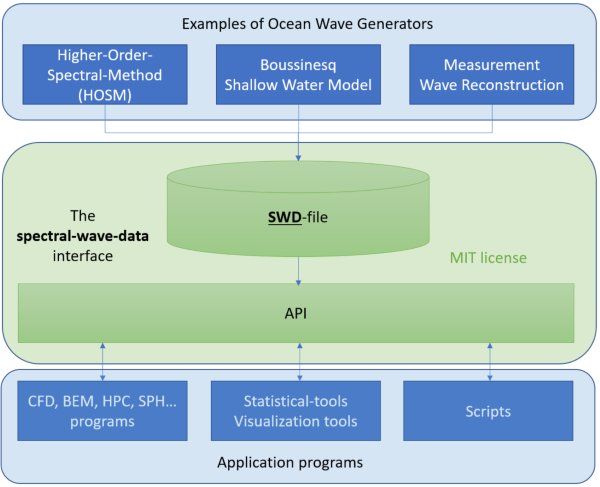

# spectral_wave_data

**NOTE: Documentation and Binaries are not uploaded yet!**

**Public release is expected 2020.04.01.**

This is the main repository of the Github organization 
[SpectralWaveData](https://github.com/SpectralWaveData).

Comprehensive [documentation](https://readthedocs.org/spectral_wave_data) 
is hosted on [ReadTheDocs](https://readthedocs.org/).

## Purpose and goals

The main idea is to provide an open API for boosting research and 
industrial application of spectral ocean wave kinematic.
This API can be utilized by academic and commercial software developers 
to assess effects of ocean gravity waves. Not limited to spectral kinematics, 
but also, as advanced boundary conditions for more sophisticated wave 
models and to study related effects on marine structures.

By using this simple but powerful interface another goal with this API 
is to tear down walls between the fields of oceanography, marine 
hydrodynamics (flow around marine structures) and structural engineering.

## What kind of waves?

There are many spectral formulations out there. Our goal is not to 
implement all of them, but to make the API generic in the sense that 
most formulations can apply this API, and that
additional formulations can easily be tested or added at a later stage
without breaking the current API. At this stage we have implemented 
long and short crested waves propagating in infinite or constant water 
depth. For long crested seas support for varying depth is also included.

The current version has been used for describing, Airy, Stokes, 
Stream waves and Higher-Order-Spectral-Method waves of arbitrary order.
Detailed kinematics of simulated rogue waves can be evaluated.

## Can I apply this API in my programs with only a small effort?

Sure, this is one of our main design goals. People apply this API with 
minor effort. Ready to use implementations of the API are provided in 
several relevant programming languages. As source code and as precompiled
libraries for Windows and Linux.

- ISO Fortran-2008
- ISO C / C++
- Python 2 and 3

The source code is in this repository. 
Precompiled binaries can be downloaded from the Release tab
and from the [Python Package Index (PyPI)](https://pypi.org/).

Under the MIT license you have great freedom to adapt the code to your needs. 
E.g. highly optimizing for your software given the same API. 
You may even implement it in another programing language.

## Does this really work?

Prior to going open software, [DNVGL](https://www.dnvgl.com/) developed
this concept and has applied it since 2015 in programs and projects, 
also extensively in commercial projects. 
A program based on the higher-order-spectral-method (HOSM) was developed 
and this API was applied for providing the nonlinear wave kinematics in 
several application programs:

 - CFD programs like OpenFOAM, StarCCM+, Comflow and Basilisk using client
   specific extensions of these programs.
 - Wasim which is a time domain 3D Rankine boundary-element-method (BEM).
 - WeeBEM is a fully nonlinear 2D-wave tank based on BEM for simulation 
   of steep waves and wave-body interaction (e.g. slamming)

Based on positive experience from these projects and some interesting
lessons learned this open source library has been created.

## Programs and tools

Some programs and tools related to utilizing this API is described in the
tools section of the [documentation](https://readthedocs.org/spectral_wave_data).

## Reference Wave fields

For reference a set of wave fields as described by this API is provided 
in the Github repository __spectral_wave_data_waves__.

Please consider a contribution to that repository if you have an 
interesting wave field to share with our community for research purpose.

Please, contact the maintainers below if you want to upload a wave-train
to the site.

## Documentation

Detailed documentation describing theory and implementation is hosted 
on the [ReadTheDocs](https://readthedocs.org/) web site. The associated 
[Sphinx](http://www.sphinx-doc.org/) documents are located in the docs
directory of __spectral_wave_data__.

## Contributing

Contributions, suggestions and discussions are welcome from
organizations and individuals.

For information on [issues, suggestions and pull requests](./CONTRIBUTION.md)

For general guide lines on collaboration, read
[our code of conduct](./CODE_OF_CONDUCT.md).

## How to interpret version numbers

We use [SemVer](http://semver.org/) for versioning. For usage 
in __spectral_wave_data__ see [VERSION.txt](./VERSION.txt).

You never know what will happen when a project is released as open source.
However, due to the many years of internal development, redesign and
comprehensive verification we initially don't expect frequent releases.
Considering this it should be safe to subscribe to the Github release 
notification service for __spectral_wave_data__.

The first public release is version 1.0.0. Care has been taken
to reduce the risk of introducing incompatible versions in the 
future. Expanding functionalities and introducing additional
spectral formulations and implementations are accounted
for by design in version 1.0.0. Will version 2.0.0 ever come? :-J

## Authors and maintainers

- Jens B. Helmers - Initial work - @jeblohe
- Odin Gramstad - Initial work - @odingramstad

See also the list of contributors who participated in this project.

## Copyrights and License

The copyright owners have licensed this project under the MIT License. 
See the [LICENSE.txt](./LICENSE.txt) file for details.

The initial copyright owner is [DNVGL](https://www.dnvgl.com/).
However, other contributors do by law automatically grant copyrights 
to their contributions.

For a good understanding on the implications of copyrights and license
it is highly recommended to read a book like:: 

  "Understanding Open Source and Free Software Licensing"
  By Andrew M. St. Laurent
  ©2011, O'Reilly Media, Inc., August 2004

[Free online access](https://www.oreilly.com/openbook/osfreesoft/book/#fullcontent)
to this book is available from [O'Reilly Media](https://www.oreilly.com/).

More copyright owners imply: Making it difficult to change the license in the future.
This is a mechanism to avoid that individual copyright owners claim
exclusive rights on future versions of this open software.

## Acknowledgments

Thank you to everybody who has contributed to the development 
and usage of the __spectral_wave_data__. 
Check out the documentation for details.
