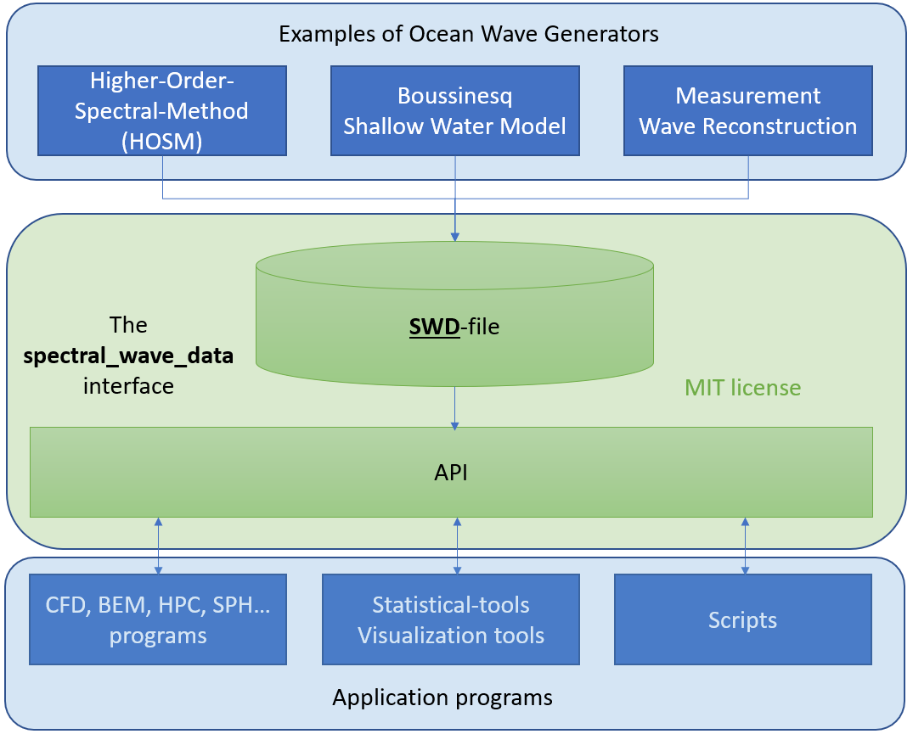

# Spectral Wave Data (SWD)

An API and file format (`*.swd`) for representation and interchange of ocean
wave kinematics.

A multitude of wave types from many different wave models can be represented,
transferred and queried by one standard API and file format.

* Regular and irregular
* Linear and non-linear
* Shallow and deep water

This is the main repository of the Github organization 
[SpectralWaveData](https://github.com/SpectralWaveData) and contains
the core library and examples of use in C, C++, Python and Fortran.

## Purpose and goals

The main goal of the SWD initiative is to provide an open API for boosting
research and industrial application of ocean wave kinematic.
Our goal is that by providing a simple, but powerful, interface we can tear
down walls between the fields of oceanography, marine hydrodynamics and
structural engineering. A motivating example: A specialist tool from the field
of oceanography can generate waves that can in turn be simulated in a fully
viscous Navier-Stokes calculation (CFD) to assess, e.g., the motion of a
floating wind turbine, without either of the tools knowing about each other.
Our hope is that SWD can become a universal language for representing waves.

The SWD API can be utilized by academic and commercial software developers 
to assess effects of ocean gravity waves due to the permissive MIT license
and the thorough documentation provided.

## What kind of waves?

There are many spectral formulations out there. Our goal is not to 
implement all of them, but to make the API generic in the sense that 
most formulations can apply this API, and that
additional formulations can easily be tested or added at a later stage
without breaking the current API. At this stage we have implemented 
long and short crested waves propagating in infinite or constant water 
depth. For long crested seas support for varying depth is also included.

The current version has been used for describing, Airy, Stokes, 
Stream-function waves and Higher-Order-Spectral-Method waves of arbitrary order.
Detailed kinematics of simulated rogue waves can be evaluated.

## Can I apply this API in my programs with only a small effort?

This is one of our main design goals! We hope you can use the SWD API with 
minor effort. Ready-to-use implementations of the API are provided in 
several relevant programming languages. As source code and as precompiled
libraries for Windows and Linux.

- ISO Fortran-2008
- ISO C / C++
- Python 2 and 3

The source code is in this repository.

Precompiled binaries and Python install (wheel) files can be downloaded from 
the "Release" tab of this repository. 

Using Windows-10 you may also install the Python distribution directly from
[PyPI](https://pypi.org/project/spectral-wave-data/) using your command line::

    pip install spectral_wave_data

Please check your system dependent [prerequisites](./PREREQUISITES.md)
for all binaries.

Given the MIT license you have freedom to adapt the code to your needs. 
E.g. highly optimizing for your software given the same API. 
You may even implement it in another programing language.

## Does this really work?

Prior to going open source, [DNV GL](https://www.dnvgl.com/) developed
this concept and has applied it since 2015 in programs and projects, 
also extensively in commercial projects. 
A program based on the higher-order-spectral-method (HOSM) was developed 
and this API was applied for providing the nonlinear wave kinematics in 
several application programs:

 - CFD programs like OpenFOAM, StarCCM+, Comflow and Basilisk using client
   specific extensions of these programs.
 - Wasim which is a time domain 3D Rankine boundary-element-method (BEM).
 - WeeBEM is a fully nonlinear 2D-wave tank based on BEM for simulation 
   of steep waves and wave-body interaction (e.g. slamming)

Based on positive experience from these projects, and some interesting
lessons learned, the open source SWD library has been created.

## Related programs and tools

Programs and tools related to utilizing this API is described in the
tools section of the 
[documentation](https://spectral-wave-data.readthedocs.io/).

## Reference Wave fields

For reference and research, a set of wave fields as described by this API will soon be provided 
in the Github repository __spectral_wave_data_waves__.

Please consider a contribution to that repository if you have an 
interesting SWD wave field to share with our community for research purpose.

Please, contact the maintainers below if you want to upload a wave-train
to the site.

## Documentation

Detailed [documentation](https://spectral-wave-data.readthedocs.io/)
describing theory and implementation is hosted 
on the [ReadTheDocs](https://readthedocs.org/) web site. The associated 
[Sphinx](http://www.sphinx-doc.org/) documents are located in the docs
directory of `spectral_wave_data`.

## Would you like to contribute?

[Contributions, suggestions and discussions](./CONTRIBUTION.md) are 
welcome from organizations and individuals.

For general guide lines on collaboration, read our
[code of conduct](./CODE_OF_CONDUCT.md).

## How to interpret version numbers

We use the [SemVer](http://semver.org/) scheme for versioning. 
For specific interpretation 
in __spectral_wave_data__ see [VERSION.txt](./VERSION.txt).

You never know what will happen when a project is released as open source.
However, due to many years of internal development, redesign and
comprehensive verification we initially don't expect frequent releases.
Consequently, we reccomend to subscribe to the Github "Release Only"
low volume notification service at the top of this page.

The first public release is version 1.0.0. Care has been taken
to reduce the risk of introducing incompatible versions in the 
future. Expanding functionalities and introducing additional
spectral formulations and alternative implementations are accounted
for by design in version 1.0.0. Hence, version 2.0.0 should never come. :-J

The current version, denoted 1.0.0-rc1, is the release candidate
expected to be identical with 1.0.0. Unless users report issues
on specific hardware/OS combinations, an identical version 
will be released using the version tag 1.0.0 on 2020.04.30.

## Authors and maintainers

- Jens B. Helmers - Initial work - @jeblohe
- Odin Gramstad - Initial work - @odingramstad

## Copyrights and License

The copyright owners have licensed this project under the MIT License. 
See the [LICENSE.txt](./LICENSE.txt) file for details.

The initial copyright owner is [DNV GL](https://www.dnvgl.com/).
However, other contributors do by law automatically get the copyright
to their contributions. The Git version control serves as the documentation.

For a good understanding on the implications of copyrights and license
it is highly recommended to read the (free) book

> [Understanding Open Source and Free Software Licensing](https://www.oreilly.com/openbook/osfreesoft/book/#fullcontent),
> 2011, Andrew M. St. Laurent,
> [O'Reilly Media, Inc.](https://www.oreilly.com/), August 2004

Having more copyright owners makes it more difficult to change the license in the future.
This is a mechanism to avoid that individual copyright owners claim
exclusive rights on future versions of this open source software.

## Acknowledgments

Thank you to everybody who has contributed to the development 
and usage of the Spectral Wave Data project. 
Check out the [documentation](https://spectral-wave-data.readthedocs.io/) for details.
