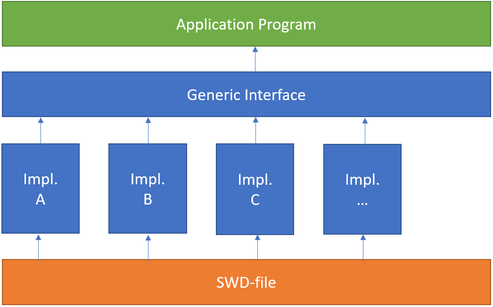

*******
The API
*******

   A generic interface handling all applied spectral wave formulations

In this section we define the official API
to be utilized in :ref:`application programs<application-program>`.

In general the API provides an abstract base class
defining a generic syntax for how to obtain kinematics and to extract
metadata.

Specialized classes are derived from the base class in order to implement
actual algorithms for a specific wave formulation.
For an actual shape type, as defined in the :doc:`theory <theory>` section, there might
be several specialized classes based on different implementations and algorithms.

The API provides a special constructor which allocate and initialize an instance of a proper
specialized class based on the content of the actual SWD and an optional
request for specific implementation.

When the specific instance has been initialized, the generic syntax from the base class
applies in the :ref:`application program<application-program>`
is independent on the actual wave formulation.

Examples of using the API are located in the
:ref:`programming application<ref_programming_applications>` section.
It is recommended to study those examples before investigating the API.

The language specific API's are very similar:

 - :doc:`Python <api_specification_Python>`
 - :doc:`C++ <api_specification_Cpp>`
 - :doc:`C <api_specification_C>`
 - :doc:`Fortran <api_specification_Fortran>`

.. toctree::
   :hidden:
   :caption: LanguageAPI

   api_specification_Python
   api_specification_Cpp
   api_specification_C
   api_specification_Fortran

