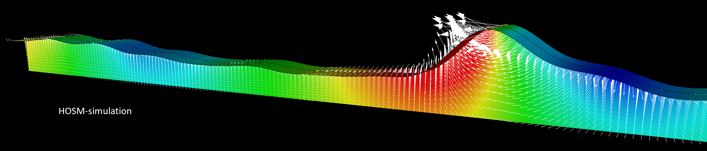

.. spectral_wave_data documentation master file, created by
   sphinx-quickstart on Sat Jul 13 10:01:12 2019.
   You can adapt this file completely to your liking, but it should at least
   contain the root `toctree` directive.

spectral_wave_data
==================

This is the documentation for the GitHub organization
`SpectralWaveData <https://github.com/SpectralWaveData>`_.

   Long crested deep water freak wave. Hs=13.5m and Tp=14.5s. Potential and velocity distribution.

.. toctree::
   :numbered:
   :maxdepth: 2
   :caption: Contents:

   intro.rst
   terminology.rst
   rationales.rst
   theory.rst
   swd_format.rst
   api_specification.rst
   programming.rst
   tools.rst
   waves.rst
   verification.rst
   contacts.rst
   acknowledgements.rst
   license.rst
   citation.rst

Indices and tables
==================

* :ref:`genindex`
