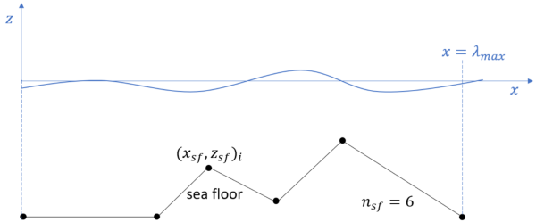

Shape class 3
-------------

This shape class describes long crested waves propagating in infinite, constant or varying water depth.
Consequently, it may be interpreted as a generalization of :doc:`Shape 1 <shape_1>` and
:doc:`Shape 2 <shape_2>`.
Because the storage and CPU requirements are similar to those specialized classes we may consider
to only apply this class for all long crested waves independent of the actual sea floor formulation.

.. math::
   \phi(x, z, t)= \sum_{j=0}^n \mathcal{Re} \Bigl\{c_j(t)\, X_j(x) \Bigr\} Z_j(z) +
                  \sum_{j=0}^{\hat{n}} \mathcal{Re}\Bigl\{\hat{c}_j(t)\, X_j(x) \Bigr\} \hat{Z}_j(z)

.. math::
   \zeta(x, t)= \sum_{j=0}^n \mathcal{Re} \Bigl\{h_j(t)\, X_j(x) \Bigr\}

.. math::
   X_j(x) = e^{-i k_j x}, \quad Z_j(z) = e^{k_j z}, \quad \hat{Z}_j(z) = e^{-k_j z},
   \quad k_j = j\cdot\Delta k, \quad i=\sqrt{-1}

The set of real constants :math:`k_j` resemble wave numbers. It follows that the
kinematics is periodic in space

.. math::
   \phi(x + \lambda_{\max}, z, t) = \phi(x, z, t), \qquad
   \zeta(x + \lambda_{\max}, t) = \zeta(x, t)
.. math::
   \lambda_{\max} = \frac{2\pi}{\Delta k}, \qquad \lambda_{\min} = \frac{\lambda_{\max}}{n}

where :math:`\lambda_{\min}` and :math:`\lambda_{\max}` are the shortest and longest
wave lengths resolved respectively.

The actual set of shape functions is uniquely defined by the three input parameters
:math:`\Delta k`, :math:`n` and  :math:`\hat{n}`.

.. note::

  The fields related to :math:`j=0` are uniform in space (DC bias). Non-zero values of
  :math:`h_0(t)` violates mass conservation.
  The amplitude :math:`c_0(t)` and :math:`\hat{c}_0(t)`
  adds a uniform time varying ambient pressure field not influencing the flow field.
  Consequently, these components will by default be suppressed in the kinematic
  calculations. However, there is an option in the API for including all DC values
  provided by the :ref:`wave generator<wave-generator>`.

  The fields related to :math:`j=n` are expected to correspond to the Nyquist
  frequency of the physical resolution applied in the
  :ref:`wave generator<wave-generator>`.
  Hence, typical :math:`n=\lfloor n_{fft}/2 \rfloor` where :math:`n_{fft}` is the physical
  spatial resolution applied in the :ref:`wave generator<wave-generator>`.

The sea floor
~~~~~~~~~~~~~

The sea floor :math:`z_{sf}(x)` is assumed single valued and is periodic with respect to the :math:`x`-location

.. math::
   z_{sf}(x + \lambda_{\max}) = z_{sf}(x)

Hence, the seafloor steepness is finite but may be arbitrary large.
In the current version of the API the sea floor is continous and piecewise linear.
As illustrated in the figure below, the sea floor is
defined by linear interpolation between :math:`n_{sf}` offset points :math:`(x_{sf},z_{sf})_i`
for :math:`i\in\{1,2,\ldots,n_{sf}\}`.
The sequence :math:`x_{sf}(i)` is monotonic increasing and covering
the range :math:`x_{sf}(i)\in[0, \lambda_{\max}]`

Infinite water depth
^^^^^^^^^^^^^^^^^^^^

The infinite depth formulation follows directly by specifying :math:`n_{sf}=0` and :math:`\hat{n}=-1`.
Consequently the formulation is equivalent to :doc:`Shape 1 <shape_1>` and there are no
spectral amplitudes :math:`\hat{c}_j(t)`.

Constant water depth
^^^^^^^^^^^^^^^^^^^^

Constant water depth :math:`d` is defined by assigning :math:`n_{sf}=1`. Hence :math:`d\equiv -z_{sf}(1)`.
The classical shallow water equations (ref :doc:`Shape 2 <shape_2>`) are reformulated using exponential terms

.. math::
    C_j(t) \frac{\cosh k_j(z+d)}{\cosh k_j d} \equiv c_j(t) Z_j(z) + \hat{c}_j(t) \hat{Z}_j(z)

.. math::
    c_j(t) = \gamma_j C_j(t), \qquad    \hat{c}_j(t) = \hat{\gamma}_j c_j(t), \qquad
   \gamma_j = \frac{1+\tanh k_j d}{2}, \qquad \hat{\gamma}_j = e^{-2k_j d}

Consequently, we only store :math:`c_j(t)` in the :ref:`SWD-file<swd-terminology>`.
At the beginning of each new time step  we construct :math:`\hat{c}_j(t)`
using :math:`c_j(t)` and the coefficient :math:`\hat{\gamma}_j`.
Because this relation is valid for all time instances the same relations are valid for the
temporal derivatives too

.. math::
    \frac{d c_j(t)}{dt} = \gamma_j \frac{d C_j(t)}{dt}, \qquad
    \frac{d \hat{c}_j(t)}{dt} = \hat{\gamma}_j \frac{d c_j(t)}{dt}

This formulation is potential faster and more numerical stable than direct evaluation of
the hyperbolic functions.

.. hint::

   In practice :math:`\hat{n} < n` because the corresponding neglected high-frequency components
   do not contribute significantly to any boundary conditions.
   For the free surface conditions this follows from the property

   .. math::
        |\hat{c}_j(t) \hat{Z}_j(z)| = |\hat{\gamma}_j c_j(t)  e^{-k_j z}|  = e^{-2k_j (d + z)} |c_j(t) Z_j(z)|
        \ll |c_j(t) Z_j(z)|

   .. math::
        \qquad j > \hat{n}, \qquad z\in[-\zeta_{\max},\zeta_{\max}], \qquad d > \zeta_{\max}

   where :math:`\zeta_{\max}` is the maximum wave elevation.
   Near the sea floor the exponential coefficient :math:`e^{-2k_j (d + z)}\to 1^-`. Consequently,
   the contribution to the boundary conditions at the sea floor vanish too,
   because :math:`|c_j(t) Z_j(z)|` vanish for large :math:`j`.

   Due to finite precision arithmetic the following upper limit is recommended

   .. math::
        \hat{n} \le \frac{\tanh^{-1}(1 - 100 \epsilon_m)}{\Delta k\cdot d}

   where :math:`\epsilon_m` is the machine precision (:math:`1+\epsilon_m=1`).

Varying water depth
^^^^^^^^^^^^^^^^^^^

Varying water depth (bathymetry) is assumed if :math:`n_{sf}>1`.
In this case also the coefficients  :math:`\hat{c}_j(t)` needs to be stored in the SWD file.

.. hint::

   For varying water depth, the additional :math:`\hat{n}` complex valued coefficients :math:`\hat{c}_j(t)`
   at time :math:`t` are expected to be determined in the :ref:`wave generator<wave-generator>`
   by adding zero-flux boundary
   conditions at :math:`2\hat{n}` distributed collocation points on the sea floor.

   Due to finite precision arithmetic the following upper limit is recommended

   .. math::
        \hat{n} \le \frac{\tanh^{-1}(1 - 100 \epsilon_m)}{-\Delta k\cdot \min\{z_{zf}\}}

   where :math:`\epsilon_m` is the machine precision (:math:`1+\epsilon_m=1`).

Kinematics
~~~~~~~~~~

Given the definitions above we obtain the following explicit kinematics:

.. math::
   \phi(\bar{x},\bar{y},\bar{z},\bar{t})= \sum_{j=0}^n \mathcal{Re} \Bigl\{c_j(t)\, X_j(x)\Bigr\} Z_j(z) +
                  \sum_{j=0}^{\hat{n}} \mathcal{Re}\Bigl\{\hat{c}_j(t)\, X_j(x) \Bigr\} \hat{Z}_j(z)
.. math::
   \varphi(\bar{x},\bar{y},\bar{z},\bar{t})= \sum_{j=0}^n \mathcal{Im} \Bigl\{c_j(t)\, X_j(x)\Bigr\} Z_j(z) -
                  \sum_{j=0}^{\hat{n}} \mathcal{Im}\Bigl\{\hat{c}_j(t)\, X_j(x)\Bigr\} \hat{Z}_j(z)

.. math::
  \frac{\partial\phi}{\partial \bar{t}}(\bar{x},\bar{y},\bar{z},\bar{t}) = \sum_{j=0}^n \mathcal{Re}
               \Bigl\{\frac{d c_j(t)}{dt} \, X_j(x)\Bigr\} Z_j(z) +
                  \sum_{j=0}^{\hat{n}} \mathcal{Re}\Bigl\{\frac{d \hat{c}_j(t)}{dt}\, X_j(x)\Bigr\} \hat{Z}_j(z)

.. math::
   \zeta(\bar{x},\bar{y},\bar{t})= \sum_{j=0}^n \mathcal{Re}
               \Bigl\{h_j(t)\, X_j(x)\Bigr\}

.. math::
  \frac{\partial\zeta}{\partial \bar{t}}(\bar{x},\bar{y},\bar{t}) = \sum_{j=0}^n \mathcal{Re}
               \Bigl\{\frac{d h_j(t)}{dt} \, X_j(x)\Bigr\}

.. math::
   \frac{\partial\zeta}{\partial \bar{x}}(\bar{x},\bar{y},\bar{t}) = \zeta_x\cos\beta, \qquad
   \frac{\partial\zeta}{\partial \bar{y}}(\bar{x},\bar{y},\bar{t}) = \zeta_x\sin\beta

.. math::
   \zeta_x = \sum_{j=0}^n k_j\mathcal{Im} \Bigl\{h_j(t)\, X_j(x)\Bigr\}

.. math::
   \bar{\nabla}\phi(\bar{x},\bar{y},\bar{z},\bar{t}) = [\phi_x\cos\beta,\phi_x\sin\beta,\phi_z]^T

.. math::
   \phi_x = \sum_{j=0}^n k_j\mathcal{Im} \Bigl\{c_j(t)\, X_j(x)\Bigr\} \, Z_j(z) +
            \sum_{j=0}^\hat{n} k_j\mathcal{Im} \Bigl\{\hat{c}_j(t)\, X_j(x)\Bigr\} \, \hat{Z}_j(z)

.. math::
   \phi_z = \sum_{j=0}^n k_j\mathcal{Re} \Bigl\{c_j(t)\, X_j(x)\Bigr\} \, Z_j(z) -
            \sum_{j=0}^\hat{n} k_j\mathcal{Re} \Bigl\{\hat{c}_j(t)\, X_j(x)\Bigr\} \, \hat{Z}_j(z)

.. math::
  \frac{\partial\bar{\nabla}\phi}{\partial \bar{t}}(\bar{x},\bar{y},\bar{z},\bar{t}) =
           [\phi_{xt}\cos\beta,\phi_{xt}\sin\beta,\phi_{zt}]^T

.. math::
   \phi_{xt} = \sum_{j=0}^n k_j \mathcal{Im} \Bigl\{\frac{d c_j(t)}{dt} \, X_j(x)\Bigr\} Z_j(z) +
               \sum_{j=0}^\hat{n} k_j \mathcal{Im} \Bigl\{\frac{d \hat{c}_j(t)}{dt} \, X_j(x)\Bigr\} \hat{Z}_j(z)

.. math::
   \phi_{zt} = \sum_{j=0}^n k_j \mathcal{Re} \Bigl\{\frac{d c_j(t)}{dt} \, X_j(x)\Bigr\} Z_j(z) -
               \sum_{j=0}^\hat{n} k_j \mathcal{Re} \Bigl\{\frac{d \hat{c}_j(t)}{dt} \, X_j(x)\Bigr\} \hat{Z}_j(z)

.. math::
  \frac{d\bar{\nabla}\phi}{d\bar{t}}(\bar{x},\bar{y},\bar{z},\bar{t}) =
           \frac{\partial\bar{\nabla}\phi}{\partial \bar{t}} +
  \bar{\nabla}\phi \cdot \bar{\nabla}\bar{\nabla}\phi

.. math::
   \bar{\nabla}\bar{\nabla}\phi (\bar{x},\bar{y},\bar{z},\bar{t}) =
     \begin{bmatrix}
       \phi_{\bar{x},\bar{x}}  & \phi_{\bar{x},\bar{y}} & \phi_{\bar{x},\bar{z}} \\
       \phi_{\bar{x},\bar{y}}  & \phi_{\bar{y},\bar{y}} & \phi_{\bar{y},\bar{z}} \\
       \phi_{\bar{x},\bar{z}}  & \phi_{\bar{y},\bar{z}} & \phi_{\bar{z},\bar{z}}
     \end{bmatrix}

.. math::
   \phi_{\bar{x},\bar{x}} = \phi_{xx}\cos^2\beta, \qquad
   \phi_{\bar{x},\bar{y}} = \phi_{xx}\sin\beta\cos\beta, \qquad
   \phi_{\bar{x},\bar{z}} = \phi_{xz}\cos\beta

.. math::
   \phi_{\bar{y},\bar{y}} = \phi_{xx}\sin^2\beta, \qquad
   \phi_{\bar{y},\bar{z}} = \phi_{xz}\sin\beta, \qquad
   \phi_{\bar{z},\bar{z}} = \phi_{zz} = -\phi_{xx}

.. math::
   \phi_{xx} = -\sum_{j=0}^n k_j^2 \mathcal{Re} \Bigl\{c_j(t) \, X_j(x)\Bigr\} Z_j(z)
               -\sum_{j=0}^\hat{n} k_j^2 \mathcal{Re} \Bigl\{\hat{c}_j(t) \, X_j(x)\Bigr\} \hat{Z}_j(z)

.. math::
   \phi_{zz} = \sum_{j=0}^n k_j^2 \mathcal{Re} \Bigl\{c_j(t) \, X_j(x)\Bigr\} Z_j(z) +
               \sum_{j=0}^\hat{n} k_j^2 \mathcal{Re} \Bigl\{\hat{c}_j(t) \, X_j(x)\Bigr\} \hat{Z}_j(z)
   = - \phi_{xx}

.. math::
   \phi_{xz} = \sum_{j=0}^n k_j^2 \mathcal{Im} \Bigl\{c_j(t) \, X_j(x)\Bigr\} Z_j(z) -
               \sum_{j=0}^\hat{n} k_j^2 \mathcal{Im} \Bigl\{\hat{c}_j(t) \, X_j(x)\Bigr\} \hat{Z}_j(z)

.. math::
   \frac{\partial^2\zeta}{\partial \bar{x}^2}(\bar{x},\bar{y},\bar{t}) = \zeta_{xx}\cos^2\beta
   \qquad
   \frac{\partial^2\zeta}{\partial \bar{y}^2}(\bar{x},\bar{y},\bar{t}) = \zeta_{xx}\sin^2\beta

.. math::
   \frac{\partial^2\zeta}{\partial\bar{x}\partial\bar{y}}(\bar{x},\bar{y},\bar{t}) =
                \zeta_{xx}\sin\beta\cos\beta

.. math::
   \zeta_{xx} = -\sum_{j=0}^n k_j^2 \mathcal{Re} \Bigl\{h_j(t) \, X_j(x)\Bigr\}

.. math::
   p = -\rho\frac{\partial\phi}{\partial \bar{t}}
       -\frac{1}{2}\rho\bar{\nabla}\phi\cdot\bar{\nabla}\phi
       -\rho g \bar{z}

where :math:`\bar{\nabla}` denotes gradients with respect to
:math:`\bar{x}`, :math:`\bar{y}` and :math:`\bar{z}`. The particle acceleration
is labeled :math:`\frac{d\bar{\nabla}\phi}{d\bar{t}}`.

The stream function :math:`\varphi` is related to the velocity potential  :math:`\phi`.
Hence :math:`\partial \phi/\partial x = \partial \varphi/\partial z`
and  :math:`\partial \phi/\partial z = -\partial \varphi/\partial x`.

Implementation notes
~~~~~~~~~~~~~~~~~~~~

Evaluation of costly transcendental functions (:math:`\cos`, :math:`\sin`, :math:`\exp`, ...)
are almost eliminated by exploiting the following recursive relations

.. math::
   X_j(x) = X_1(x)\, X_{j-1}(x), \qquad
   Z_j(z) = Z_1(z)\, Z_{j-1}(z), \qquad
   \hat{Z}_j(z) = \hat{Z}_1(z)\, \hat{Z}_{j-1}(z)

In case the :ref:`wave generator<wave-generator>` applies a perturbation theory of
order :math:`q` we apply the following Taylor expansions above the calm free surface.

.. math::
   Z_j(z) = 1 + \sum_{p=1}^{q-1}\frac{(k_j z)^p}{p!}, \qquad
   \hat{Z}_j(z) = 1 + \sum_{p=1}^{q-1}\frac{(-k_j z)^p}{p!}, \qquad z > 0
