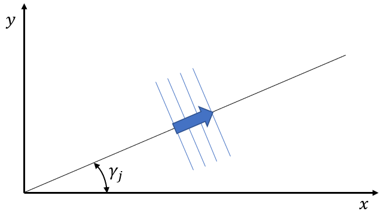

Shape class 6
-------------

This shape class describes a general set of linear Airy waves propagating in infinite or constant water depth :math:`d`.
Schemes for evaluation of kinematics above :math:`z=0` is described below.

.. note::

  Due to the flexibility of allowing varying spacing of wave frequencies the default implementation of this
  shape class is not ideal for simulation of irregular seas with a large number of frequencies. For such
  simulations it is highly recommended to apply shape class 1, 2, 4 or 5 for speed considerations.

.. math::
   \phi(x,y,z,t) = \sum_{j=1}^{n} \frac{-g A_j}{\omega_j}Z_j(z)
                                   \sin(\omega_j t - k_{j_x} x - k_{j_y} y + \delta_j) =
                 \sum_{j=1}^{n} \mathcal{Re} \Bigl\{c_{j}(t)\, E_{j}(x, y)\Bigr\}\, Z_{j}(z)

.. math::
  \zeta(x,y,t) = \sum_{j=1}^{n} A_j\cos(\omega_j t - k_{j_x} x - k_{j_y} y + \delta_j) =
                 \sum_{j=1}^{n}  \mathcal{Re} \Bigl\{h_{j}(t) \,E_{j}(x, y)\Bigr\}

.. math::
  E_{j}(x, y) = e^{-i(k_{j_x} x + k_{j_y} y)}, \qquad
  Z_{j}(z) = \frac{\cosh k_{j}(z+d)}{\cosh k_{j} d}

.. math::
  c_{j}(t) = i \frac{g A_j}{\omega_j} e^{i(\omega_j t + \delta_j)}, \qquad
  h_{j}(t) = A_j e^{i(\omega_j t + \delta_j)}

.. math::
  \omega_j^2 = k_j g \tanh(k_j d), \quad k_{j_x} =  k_j\,\cos\gamma_j,
  \quad k_{j_y} = k_j\,\sin\gamma_j, \quad i = \sqrt{-1}

Wave component :math:`j` propagates with an angle :math:`\gamma_j` relative to the SWD :math:`x`-axis as
indicated in this figure.

The single amplitude of the wave component is :math:`A_j` and the oscillation frequency is :math:`\omega_j`.
The phase is :math:`\delta_j`. The acceleration of gravity is denoted :math:`g`.

For infinite water depth :math:`d` we obtain the asymptotic relations

.. math::
  Z_{j}(z) = e^{k_j z}, \qquad \omega_j^2 = k_j g

The actual set of shape functions is uniquely defined by the input parameters
:math:`A_j`, :math:`k_j`, :math:`\gamma_j`, :math:`\delta_j`, :math:`n`, :math:`g` and :math:`d`.
Negative :math:`d` on input indicates infinite water depth.

Kinematics
^^^^^^^^^^

Given the definitions above we obtain the following explicit kinematics:

.. math::
   \phi(\bar{x},\bar{y},\bar{z},\bar{t})= \sum_{j=1}^{n} \mathcal{Re} \Bigl\{c_{j}(t)\, E_{j}(x, y)\Bigr\}\, Z_{j}(z)

.. math::
   \varphi(\bar{x},\bar{y},\bar{z},\bar{t}) =
                      \begin{cases}
      \sum_{j=1}^n \mathcal{Im} \Bigl\{c_j(t)\, E_{j}(x, y)\Bigr\} \hat{Z}_j(z), & \text{if all $\gamma_j=\gamma_1$},\\
                                      0,                                         & \text{otherwise}
                      \end{cases}

.. math::
  \frac{\partial\phi}{\partial \bar{t}}(\bar{x},\bar{y},\bar{z},\bar{t}) = \sum_{j=1}^{n}
              \mathcal{Re} \Bigl\{\frac{d c_j(t)}{dt}\, E_{j}(x, y)\Bigr\}\, Z_{j}(z)

.. math::
   \zeta(\bar{x},\bar{y},\bar{t})= \sum_{j=1}^{n}
               \mathcal{Re} \Bigl\{h_{j}(t) \,E_{j}(x, y)\Bigr\}

.. math::
  \frac{\partial\zeta}{\partial \bar{t}}(\bar{x},\bar{y},\bar{t}) = \sum_{j=1}^{n}
               \mathcal{Re} \Bigl\{\frac{d h_j(t)}{dt} \,E_{j}(x, y)\Bigr\}

.. math::
   \frac{\partial\zeta}{\partial \bar{x}}(\bar{x},\bar{y},\bar{t}) = \zeta_x\cos\beta - \zeta_y\sin\beta, \qquad
   \frac{\partial\zeta}{\partial \bar{y}}(\bar{x},\bar{y},\bar{t}) = \zeta_x\sin\beta + \zeta_y\cos\beta

.. math::
   \zeta_x =\sum_{j=1}^{n} k_{j_x} \mathcal{Im} \Bigl\{h_{j}(t) \,E_{j}(x, y)\Bigr\}

.. math::
   \zeta_y = \sum_{j=1}^{n} k_{j_y} \mathcal{Im} \Bigl\{h_{j}(t) \,E_{j}(x, y)\Bigr\}

.. math::
   \bar{\nabla}\phi(\bar{x},\bar{y},\bar{z},\bar{t}) =
              [\phi_x\cos\beta - \phi_y\sin\beta, \phi_x\sin\beta + \phi_y\cos\beta,\phi_z]^T

.. math::
   \phi_x = \sum_{j=1}^{n}
          k_{j_x}\mathcal{Im} \Bigl\{c_{j}(t)\, E_{j}(x, y)\Bigr\}\, Z_{j}(z)

.. math::
   \phi_y = \sum_{j=1}^{n}
          k_{j_y}\mathcal{Im} \Bigl\{c_{j}(t)\, E_{j}(x, y)\Bigr\}\, Z_{j}(z)

.. math::
   \phi_z = \sum_{j=1}^{n}
          \mathcal{Re} \Bigl\{c_{j}(t)\, E_{j}(x, y)\Bigr\} \, \frac{d Z_{j}(z)}{dz}

.. math::
  \frac{\partial\bar{\nabla}\phi}{\partial \bar{t}}(\bar{x},\bar{y},\bar{z},\bar{t}) =
              [\phi_{xt}\cos\beta - \phi_{yt}\sin\beta, \phi_{xt}\sin\beta + \phi_{yt}\cos\beta,\phi_z]^T

.. math::
   \phi_{xt} = \sum_{j=1}^{n}
          k_{j_x}\mathcal{Im} \Bigl\{\frac{d c_j(t)}{dt}\, E_{j}(x, y)\Bigr\}\, Z_{j}(z)

.. math::
   \phi_{yt} = \sum_{j=1}^{n}
          k_{j_y}\mathcal{Im} \Bigl\{\frac{d c_j(t)}{dt}\, E_{j}(x, y)\Bigr\}\, Z_{j}(z)

.. math::
   \phi_{zt} = \sum_{j=1}^{n}
          \mathcal{Re} \Bigl\{\frac{d c_j(t)}{dt}\, E_{j}(x, y)\Bigr\} \, \frac{d Z_{j}(z)}{dz}

.. math::
  \frac{d\bar{\nabla}\phi}{d\bar{t}}(\bar{x},\bar{y},\bar{z},\bar{t}) =
           \frac{\partial\bar{\nabla}\phi}{\partial \bar{t}} +
  \bar{\nabla}\phi \cdot \bar{\nabla}\bar{\nabla}\phi

.. math::
   \bar{\nabla}\bar{\nabla}\phi (\bar{x},\bar{y},\bar{z},\bar{t}) =
     \begin{bmatrix}
       \phi_{\bar{x},\bar{x}}  & \phi_{\bar{x},\bar{y}} & \phi_{\bar{x},\bar{z}} \\
       \phi_{\bar{x},\bar{y}}  & \phi_{\bar{y},\bar{y}} & \phi_{\bar{y},\bar{z}} \\
       \phi_{\bar{x},\bar{z}}  & \phi_{\bar{y},\bar{z}} & \phi_{\bar{z},\bar{z}}
     \end{bmatrix}

.. math::
   \phi_{\bar{x},\bar{x}} = \phi_{xx}\cos^2\beta - \phi_{xy}\sin(2\beta) + \phi_{yy}\sin^2\beta

.. math::
   \phi_{\bar{x},\bar{y}} = \phi_{xy}(\cos^2\beta - \sin^2\beta) + (\phi_{xx} - \phi_{yy})\sin\beta\cos\beta

.. math::
   \phi_{\bar{x},\bar{z}} = \phi_{xz}\cos\beta - \phi_{yz}\sin\beta

.. math::
   \phi_{\bar{y},\bar{y}} = \phi_{yy}\cos^2\beta + \phi_{xy}\sin(2\beta) + \phi_{xx}\sin^2\beta

.. math::
   \phi_{\bar{y},\bar{z}} = \phi_{yz}\cos\beta + \phi_{xz}\sin\beta

.. math::
   \phi_{\bar{z},\bar{z}} = \phi_{zz} = -\phi_{xx} -\phi_{yy}

.. math::
   \phi_{xx} = - \sum_{j=1}^{n}
       k_{j_x}^2 \mathcal{Re} \Bigl\{c_{j}(t)\, E_{j}(x, y)\Bigr\}\, Z_{j}(z)

.. math::
   \phi_{xy} = - \sum_{j=1}^{n}
       k_{j_x} k_{j_y} \mathcal{Re} \Bigl\{c_{j}(t)\, E_{j}(x, y)\Bigr\}\, Z_{j}(z)

.. math::
   \phi_{xz} = \sum_{j=1}^{n}
       k_{j_x} \mathcal{Im} \Bigl\{c_{j}(t)\, E_{j}(x, y)\Bigr\}\,  \frac{d Z_{j}(z)}{dz}

.. math::
   \phi_{yy} = - \sum_{j=1}^{n}
       k_{j_y}^2 \mathcal{Re} \Bigl\{c_{j}(t)\, E_{j}(x, y)\Bigr\}\, Z_{j}(z)

.. math::
   \phi_{yz} = \sum_{j=1}^{n}
       k_{j_y} \mathcal{Im} \Bigl\{c_{j}(t)\, E_{j}(x, y)\Bigr\}\, \frac{d Z_{j}(z)}{dz}

.. math::
   \phi_{zz} = \sum_{j=1}^{n}
       \mathcal{Re} \Bigl\{c_{j}(t)\, E_{j}(x, y)\Bigr\}\, \frac{d^2 Z_{j}(z)}{dz^2}
       = -\phi_{xx} - \phi_{yy}

.. math::
   \frac{\partial^2\zeta}{\partial \bar{x}^2}(\bar{x},\bar{y},\bar{t}) =
      \zeta_{xx}\cos^2\beta - \zeta_{xy}\sin(2\beta) + \zeta_{yy}\sin^2\beta

.. math::
   \frac{\partial^2\zeta}{\partial\bar{x}\partial\bar{y}}(\bar{x},\bar{y},\bar{t}) =
      \zeta_{xy}(\cos^2\beta - \sin^2\beta) + (\zeta_{xx} - \zeta_{yy})\sin\beta\cos\beta

.. math::
   \frac{\partial^2\zeta}{\partial\bar{y}^2}(\bar{x},\bar{y},\bar{t}) =
      \zeta_{yy}\cos^2\beta  + \zeta_{xy}\sin(2\beta) + \zeta_{xx}\sin^2\beta

.. math::
   \zeta_{xx} = -\sum_{j=1}^{n}
      k_{j_x}^2 \mathcal{Re} \Bigl\{h_{j}(t)\, E_{j}(x, y)\Bigr\}

.. math::
   \zeta_{xy} = -\sum_{j=1}^{n}
      k_{j_x} k_{j_y} \mathcal{Re} \Bigl\{h_{j}(t)\, E_{j}(x, y)\Bigr\}

.. math::
   \zeta_{yy} = -\sum_{j=1}^{n}
      k_{j_y}^2 \mathcal{Re} \Bigl\{h_{j}(t)\, E_{j}(x, y)\Bigr\}

.. math::
   p = -\rho\frac{\partial\phi}{\partial \bar{t}}
       -\frac{1}{2}\rho\bar{\nabla}\phi\cdot\bar{\nabla}\phi
       -\rho g \bar{z}

where :math:`\bar{\nabla}` denotes gradients with respect to
:math:`\bar{x}`, :math:`\bar{y}` and :math:`\bar{z}`.
:math:`\mathcal{Re}\{\alpha\}` and :math:`\mathcal{Im}\{\alpha\}` denote the real and imaginary part of a
complex number :math:`\alpha`.

The particle acceleration is labeled :math:`\frac{d\bar{\nabla}\phi}{d\bar{t}}`.

The stream function :math:`\varphi` is only relevant for long crested waves and is
related to the velocity potential  :math:`\phi`.
Hence :math:`\partial \phi/\partial x = \partial \varphi/\partial z`
and  :math:`\partial \phi/\partial z = -\partial \varphi/\partial x`.
Note that for the stream function evaluation we apply the function

.. math::
    \hat{Z}_j(z) = \frac{\sinh k_j(z+d)}{\cosh k_j d}

Kinematics above :math:`z=0`
^^^^^^^^^^^^^^^^^^^^^^^^^^^^

The kinematics above :math:`z=0` is not well defined by the Airy theory. However, the following schemes are
defined by the constructor parameter **norder**.

+------------+------------------------------------------------------------------------------------------------------+
| **norder** | Scheme                                                                                               |
+============+======================================================================================================+
| :math:`<0` | | Always evaluate the exponential terms at the actual location. This is not recommended              |
|            | | unless the wave slope is very small.                                                               |
+------------+------------------------------------------------------------------------------------------------------+
| :math:`0`  | Evaluate the exponential terms at :math:`z \leftarrow min(z,0)` (default)                            |
+------------+------------------------------------------------------------------------------------------------------+
| :math:`1`  | Apply linear extrapolation above :math:`z=0`                                                         |
+------------+------------------------------------------------------------------------------------------------------+
| :math:`2`  | Wheeler stretching: Evaluate exponential terms at                                                    |
|            | :math:`z \leftarrow  \frac{z-\zeta(x,y,t)}{1+\zeta(x,y,t)/d}`                                        |
+------------+------------------------------------------------------------------------------------------------------+

It should be noted that the wave field is not harmonic when using e.g. Wheeler stretching.
Consequently, all kinematics become more approximative. (E.g. no mass conservation)

At steep crests the choice of **norder** may significantly influence the results.

For the linear extrapolation scheme we obtain:

.. math::
   Z_{j}(z) = 1 + tanh(k_jd)\, k_jz, \qquad \hat{Z}_{j}(z) = tanh(k_jd) + k_jz, \qquad z > 0

Implementation notes
^^^^^^^^^^^^^^^^^^^^

For Airy waves the temporal derivatives of :math:`c_j(t)` and :math:`h_j(t)` have the analytical expressions

.. math::
  \frac{d c_j(t)}{dt} = -g h_{j}(t), \quad
  \frac{d h_j(t)}{dt} = i\omega_j h_{j}(t)

Note also that

.. math::
   \frac{d Z_{j}(z)}{dz} = k_j \hat{Z}_j(z), \qquad  \frac{d^2 Z_{j}(z)}{dz^2} = k_j^2 Z_{j}(z)

.. math::
   \frac{d \hat{Z}_{j}(z)}{dz} = k_j Z_j(z), \qquad  \frac{d^2 \hat{Z}_{j}(z)}{dz^2} = k_j^2 \hat{Z}_{j}(z)

.. math::
   Z_{j}(z) = a\frac{1+c}{1+b}, \qquad  \hat{Z}_j(z) = a\frac{1-c}{1+b}

.. math::
   a = e^{k_j z} \quad b = e^{-2k_j d} < 1, \quad c = b/a^2 \le 1

These exact fractional expressions for :math:`Z_{j}(z)` and :math:`\hat{Z}_j(z)` are always numerical stable.
For the linear extrapolation scheme above :math:`z=0` we get:

.. math::
   Z_{j}(z) = 1+\frac{1-b}{1+b}k_j z, \qquad  \hat{Z}_j(z) = \frac{1-b}{1+b} + k_j z

