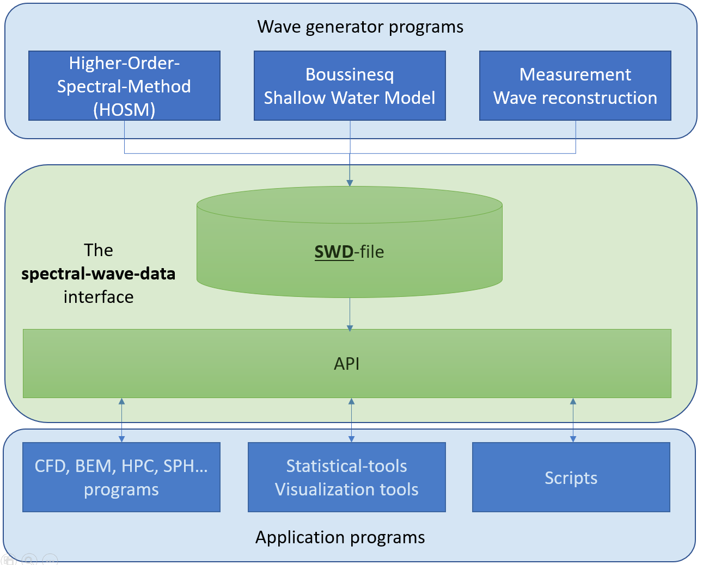

************
Terminology
************

In this documentation we apply a vocabulary based on the following figure.

.. _wave-generator:

Wave generator
^^^^^^^^^^^^^^

A wave generator is any program or script capable of constructing a sound SWD-file.
There are no restrictions on theoretical models applied in wave generators.

.. _application-program:

Application program
^^^^^^^^^^^^^^^^^^^

Any program or scripts applying a SWD-file and the associated API for
evaluating the spectral wave kinematics is referred to as an application program.

.. _swd-terminology:

The Spectral-Wave-Data (SWD) file
^^^^^^^^^^^^^^^^^^^^^^^^^^^^^^^^^

All SWD files comply with the file format as :doc:`specified <swd_format>` in this documentation.
It contains the spectral description of a particular wave field as
explained in the theory section.

.. _API-terminology:

API
^^^

This documentation describes an object oriented interface for evaluation of wave kinematics based on the
contents of a SWD file. This interface is considered the SWD-API (the Application-Programming-Interface).

This API, including an implementation, is distributed as part of the
`spectral_wave_data <https://github.com/SpectralWaveData/spectral_wave_data>`_ repository.
Source code and precompiled libraries are available in several promgramming languages.
C++, C, Fortrran-2008, Python-2 and Python-3.

Site specific or vendor optimized implementations complying with this API are considered
SWD compliant if numerical results do not differ
significantly from results using the code in this repository.
