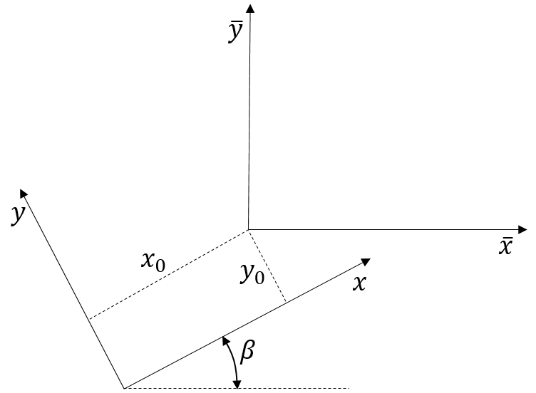
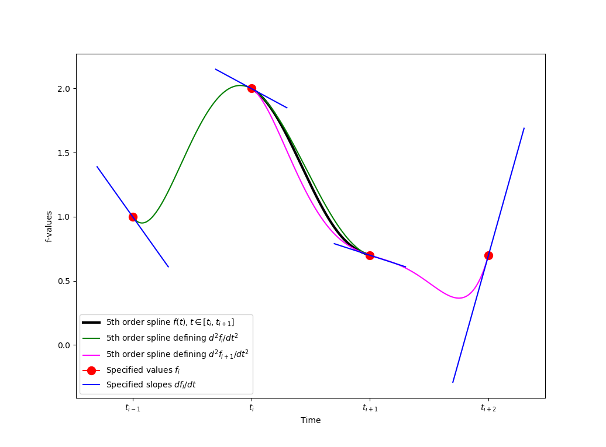

******
Theory
******

In this chapter we define the wave formulation as applied in the
`spectral_wave_data <https://github.com/SpectralWaveData/spectral_wave_data>`_ API.

The :ref:`wave generator<wave-generator>` may apply other formulations but is
required to do eventual output transformations to comply with the definitions described in this document.
Such modifications are typical minor, limited to apply sign shifts, complex conjugate etc. in output statements.

The  :ref:`wave generator<wave-generator>` producing the wave field do not consider the location,
orientation and speed of eventual structures. As a consequence, the produced ambient wave field can be reused
for assessing different structural configurations.

The SWD coordinate system
=========================

The spectral_wave_data (SWD) wave field is described in an earth fixed right-handed Cartesian coordinate system
:math:`\mathbf{x}=(x,y,z)` where :math:`z=0` coincides with the calm free surface and the :math:`z`-axis
is pointing upwards. This is the coordinate system applied in the :doc:`SWD file <swd_format>`.

For long crested seas, waves are assumed to propagate in the positive :math:`x`-direction.

For short crested seas, waves may propagate in all directions. Consequently, the orientation of the
:math:`x`-direction is not specified by the API. However, if there is a time independent main propagation
direction it is expected to be in the positive :math:`x`-direction. In case of varying bathymetry
this expectation may not apply.

The application defined wave coordinate system
==============================================

The `spectral_wave_data <https://github.com/SpectralWaveData/spectral_wave_data>`_ API
is designed to be applied in a wide range of :ref:`application programs<application-program>`.
Consequently, an earth fixed, right-handed, Cartesian wave coordinate systems
:math:`\mathbf{\bar{x}}=(\bar{x},\bar{y},\bar{z})`
related to the  :ref:`application program<application-program>` may differ from the SWD coordinate system.
It is assumed that :math:`\bar{z}=0` coincides with the calm free surface and the
:math:`\bar{z}`-axis is pointing upwards.

The relation between the SWD and the wave coordinate system applied in the
:ref:`application program<application-program>` is defined by the
3 spatial shift parameters :math:`x_0`, :math:`y_0` and :math:`\beta`.
The location of the application origin is :math:`(x_0, y_0, 0)` observed from
the SWD system. The :math:`x`-axis is rotated :math:`\beta` relative to the :math:`\bar{x}`-axis.

These relations are expressed as

.. math::
  x - x_0 =   \bar{x}\cos\beta + \bar{y}\sin\beta, \qquad
  y - y_0 =  -\bar{x}\sin\beta + \bar{y}\cos\beta

.. math::
  z = \bar{z}, \qquad  t - t_0 =  \bar{t}, \qquad t_0 \ge 0

The shift parameter :math:`t_0` relates the time :math:`t`
defined in the SWD system relative to the time :math:`\bar{t}` in the :ref:`application program<application-program>`.

   The relation between the SWD :math:`\mathbf{x}` and the earth fixed
   :ref:`application program<application-program>` coordinate
   system :math:`\mathbf{\bar{x}}`. In this example :math:`x_0`, :math:`y_0` and :math:`\beta`
   are all positive quantities.

The spectral formulation
=========================

Assuming an ocean of ideal fluid, the incident velocity  potential :math:`\phi(\mathbf{x}, t)`
and the corresponding single valued surface elevation  :math:`\zeta(x, y, t)` at time :math:`t` are
expressed with respect to the SWD coordinate system as

.. math::
   \phi(\mathbf{x}, t)= \sum_{j=1}^n \mathcal{Re} \Bigl\{c_j(t)\, \psi_j(\mathbf{x})\Bigr\}, \qquad
   \zeta(x, y, t)= \sum_{j=1}^n \mathcal{Re} \Bigl\{h_j(t)\, \xi_j(x, y)\Bigr\}

where both sets of :math:`n` explicit shape functions :math:`\psi_j(\mathbf{x})` and :math:`\xi_j(x, y)`
are orthogonal on the global considered space. The functions :math:`\psi_j(\mathbf{x})` are harmonic.
The number of shape functions :math:`n`  defines a time independent spatial resolution of the
wave field. Consequently, constrained by the given resolution :math:`n` a wide range of wave fields can
be described given the shape functions and the temporal amplitudes :math:`c_j(t)` and :math:`h_j(t)`.
Obvious exceptions are overturning waves and viscous flows, but a large class of important nonlinear
wave trains may be described in addition to all the classical perturbation wave models (Airy, Stokes, Stream waves, etc.).

The shape functions and temporal amplitudes may in general be complex functions.
We let :math:`\mathcal{Re}\{\alpha\}` and :math:`\mathcal{Im}\{\alpha\}`
denote the real and imaginary part of a complex number :math:`\alpha`.

Spectral kinematics
===================

Given the wave potential as defined above, the API may evaluate kinematics as described in the following table.

.. table::

   +-----------------------------------------------+-----------------------+-------------------------------------------------------------------------------------+
   | Symbol                                        | API                   | Note                                                                                |
   +===============================================+=======================+=====================================================================================+
   |:math:`\phi`                                   | :meth:`phi`           | | The velocity potential is often applied as Dirichlet conditions in                |
   |                                               |                       | | potential flow solvers.                                                           |
   +-----------------------------------------------+-----------------------+-------------------------------------------------------------------------------------+
   |:math:`\varphi`                                | :meth:`stream`        | | The stream function is orthogonal to the                                          |
   |                                               |                       |   velocity potential.                                                               |
   |                                               |                       |   :math:`\frac{\partial \phi}{\partial x}=\frac{\partial\varphi}{\partial z}`       |
   |                                               |                       | | and :math:`\frac{\partial\phi}{\partial z} = -\frac{\partial\varphi}{\partial x}` |
   |                                               |                       |   The stream function is only relevant for long crested                             |
   |                                               |                       | | waves. For short crested seas we define :math:`\varphi\equiv 0` for all           |
   |                                               |                       |   :math:`\mathbf{x}` and :math:`t`.                                                 |
   +-----------------------------------------------+-----------------------+-------------------------------------------------------------------------------------+
   |:math:`\frac{\partial\phi}{\partial t}`        | :meth:`phi_t`         | | is the time rate of change of :math:`\phi` at an earth fix location. It is        |
   |                                               |                       | | sometimes applied as Dirichlet conditions in potential flow solvers. This         |
   |                                               |                       | | term is an important part of the pressure field. For linear models it is          |
   |                                               |                       | | proportional to the dynamic pressure.                                             |
   +-----------------------------------------------+-----------------------+-------------------------------------------------------------------------------------+
   | :math:`\nabla\phi`                            | :meth:`grad_phi`      | The fluid particle velocity                                                         |
   +-----------------------------------------------+-----------------------+-------------------------------------------------------------------------------------+
   | :math:`\nabla\nabla\phi`                      | :meth:`grad_phi_2nd`  | | The second order spatial gradients of :math:`\phi` are sometimes applied as       |
   |                                               |                       | | boundary conditions in potential flow solvers. They are also needed for           |
   |                                               |                       | | calculating particle accelerations.                                               |
   +-----------------------------------------------+-----------------------+-------------------------------------------------------------------------------------+
   | :math:`\frac{\partial\nabla\phi}{\partial t}` | :meth:`acc_euler`     | The Euler acceleration. (Earth fixed location)                                      |
   +-----------------------------------------------+-----------------------+-------------------------------------------------------------------------------------+
   | :math:`\frac{d\nabla\phi}{dt}`                | :meth:`acc_particle`  | The fluid particle acceleration                                                     |
   +-----------------------------------------------+-----------------------+-------------------------------------------------------------------------------------+
   | :math:`p`                                     | :meth:`pressure`      | The fluid pressure including all terms in Bernoulli's equation.                     |
   +-----------------------------------------------+-----------------------+-------------------------------------------------------------------------------------+
   | :math:`\zeta`                                 | :meth:`elev`          | The surface elevation                                                               |
   +-----------------------------------------------+-----------------------+-------------------------------------------------------------------------------------+
   | :math:`\frac{\partial\zeta}{\partial t}`      | :meth:`elev_t`        | The time rate of change of surface elevation  (At fixed horizontal location)        |
   +-----------------------------------------------+-----------------------+-------------------------------------------------------------------------------------+
   | :math:`\nabla\zeta`                           | :meth:`grad_elev`     | | Spatial gradients of the surface elevation is often applied in boundary           |
   |                                               |                       | | conditions                                                                        |
   +-----------------------------------------------+-----------------------+-------------------------------------------------------------------------------------+
   | :math:`\nabla\nabla\zeta`                     | :meth:`grad_elev_2nd` | | The second order spatial gradients of the surface elevation are sometimes         |
   |                                               |                       | | applied in boundary conditions for potential flow solvers.                        |
   +-----------------------------------------------+-----------------------+-------------------------------------------------------------------------------------+

Shape classes
=============

We define a shape class as a specific set of parameterized shape functions
:math:`\psi_j(\mathbf{x})` and :math:`\xi_j(x, y)` as explained above.
A wave field is assumed to be described by a single shape class.

Because :math:`\psi_j(\mathbf{x})` is harmonic we may in general write

.. math::
   \psi_j(\mathbf{x})= X_j(x)\, Y_j(y)\, Z_j(z)

In the current version, the official API implements the following shape classes

 - :doc:`Shape 1 <shape_1>` For long crested waves propagating in infinite water depth.
 - :doc:`Shape 2 <shape_2>` For long crested waves propagating in constant finite water depth.
 - :doc:`Shape 3 <shape_3>` For long crested waves propagating in infinite, constant or varying water depth.
 - :doc:`Shape 4 <shape_4>` For short crested waves propagating in infinite water depth.
 - :doc:`Shape 5 <shape_5>` For short crested waves propagating in constant finite water depth.
 - :doc:`Shape 6 <shape_6>` For a general set of Airy waves. Infinite or constant water depth.

.. toctree::
   :hidden:
   :caption: Shapes

   shape_1
   shape_2
   shape_3
   shape_4
   shape_5
   shape_6

Temporal amplitudes
===================

Applying a shape class as defined above, the kinematics at time :math:`t`
is well defined given the set of associated
temporal amplitudes :math:`c_j(t)` and :math:`h_j(t)`.
The :ref:`wave generators<wave-generator>`  are required by this API to provide discrete
values of these functions at equidistant time intervals via the :doc:`SWD file <swd_format>`.
In order to obtain consistent smooth kinematics
in :ref:`application programs<application-program>` for all :math:`t`,
it is also required that :math:`\frac{dc_j(t)}{dt}` and :math:`\frac{dh_j(t)}{dt}`
are provided by the  :ref:`wave generators<wave-generator>` at the same time intervals. In order to minimize
errors in :ref:`application programs<application-program>` the latter functions should be provided directly from the
kinematic and dynamic free surface conditions and not by using temporal finite difference
schemes:

.. math::
   \frac{\partial\phi}{\partial t} =
   \sum_{j=1}^n \mathcal{Re} \Bigl\{\frac{dc_j(t)}{dt}\, \psi_j(\mathbf{x})\Bigr\} = f_d(\phi, \nabla\phi, \ldots)

.. math::
   \frac{\partial\zeta}{\partial t} =
   \sum_{j=1}^n \mathcal{Re} \Bigl\{\frac{dh_j(t)}{dt}\, \xi_j(x, y)\Bigr\} = f_k(\phi, \nabla\phi, \ldots)

where the functions :math:`f_d()` and :math:`f_k()` follows from the applied dynamic and kinematic free surface
conditions and are calculated using *spatial* analytical gradients only.

.. note::

 - For spectral solvers :math:`\frac{dc_j(t)}{dt}` and :math:`\frac{dh_j(t)}{dt}` are
   obtained from the right-hand-side of the temporal ordinary-differential-equation system.
 - Only a few time steps of  :math:`c_j(t)`, :math:`h_j(t)`, :math:`\frac{dc_j(t)}{dt}`
   and :math:`\frac{dh_j(t)}{dt}` needs to be in memory for evaluating the kinematics
   at any time instance.
 - The presence of explicit values of :math:`\frac{dc_j(t)}{dt}` and :math:`\frac{dh_j(t)}{dt}`
   ensures that the kinematics produced by the API comply with the physical boundary
   conditions at the specified instances.
 - When applying interpolation schemes including constraints of derivatives, the issue of over-shooting
   is reduced.

Consistent interpolation
------------------------

Given the value and slope of :math:`c_j(t)` and :math:`h_j(t)` at equidistant time instances
:math:`t_{i}, t_{i+1},\ldots`
it is important that the predicted kinematics between these intervals are consistent and
sufficiently smooth for proper application in other solvers. E.g. if the potential :math:`\phi` is
assumed linear between two time steps the pressure distribution will be discontinuous at every
new time interval due to the pressure component :math:`\frac{\partial\phi}{\partial t}`.
This is not acceptable.

In order to deal with simulations over a long time range it is important that the constant time intervals
:math:`\Delta t= t_{i+1} - t_i` can be relatively large. Even slightly larger than in the
program providing the kinematics. The program that applies the kinematics may have order of magnitude
smaller time steps like in slamming CFD simulations. The kinematics provided by this API should not
introduce numerical noise in such calculations.

Let :math:`f_i` and :math:`\frac{df_i}{dt}` denote :math:`c_j(t_i)` and :math:`\frac{dc_j(t_i)}{dt}` or
:math:`h_j(t_i)` and :math:`\frac{dh_j(t_i)}{dt}` respectively.
When the application program updates the actual time :math:`t` to an arbitrary value,
the API will once approximate the values of :math:`f(t)` and :math:`\frac{df(t)}{dt}`
using one of the interpolation schemes described below. Then any kinematics at time
:math:`t` can be evaluated using these current spectral amplitudes.

Two alternative interpolation schemes are provided.

:math:`C^1` continuous spline
^^^^^^^^^^^^^^^^^^^^^^^^^^^^^

Given the spectral data at two subsequent time steps :math:`t_i` and :math:`t_{i+1}`

.. math::

   f_i, f_{i+1}, \frac{df_i}{dt}, \frac{df_{i+1}}{dt}

we `obtain <https://en.wikipedia.org/wiki/Spline_interpolation#Algorithm_to_find_the_interpolating_cubic_spline>`_
a cubic spline which is :math:`C^1` continuous at the boundary of each time interval.

.. math::
   f(t) =  (1-\delta)f_i + \delta f_{i+1} +
           \delta(1-\delta)(a(1-\delta) + b \delta), \qquad t\in[t_i, t_{i+1}]

.. math::
   \frac{df}{dt}(t) = \frac{f_{i+1} - f_i}{\Delta t} +
   (1-2\delta)\frac{a(1-\delta) + b\delta}{\Delta t} +
   \delta(1-\delta)\frac{b-a}{\Delta t}

.. math::
   \delta = \frac{t-t_i}{\Delta t}, \qquad
   a = \Delta t\frac{df_i}{dt} - (f_{i+1} - f_i)

.. math::
   b = -\Delta t\frac{df_{i+1}}{dt} + (f_{i+1} - f_i)

This spline  will produce a pressure field which is :math:`C^0` continuous
at the transition of each time step.

:math:`C^2` continuous spline
^^^^^^^^^^^^^^^^^^^^^^^^^^^^^

.. note::

   This is the default scheme in the API.

Some boundary value formulations require continuity of quantities like
:math:`\frac{\partial^2\phi}{\partial t^2}` and
:math:`\frac{\partial^2\zeta}{\partial t^2}`. Since we know the first order derivatives
from the dynamic and kinematic free surface conditions
we construct a spline which is second order continuous at the transitions of time steps
by first approximating the second order gradients at these points.

The following approximations

.. math::
  \frac{d^2 f_i}{dt^2} \approx
  2\frac{f_{i-1} - 2 f_i + f_{i+1}}{\Delta t^2} -
  \frac{\frac{d f_{i+1}}{dt} -
        \frac{d f_{i-1}}{dt}}{2\Delta t}

.. math::
  \frac{d^2 f_{i+1}}{dt^2} \approx
  2\frac{f_{i} - 2 f_{i+1} + f_{i+2}}{\Delta t^2} -
  \frac{\frac{d f_{i+2}}{dt} -
        \frac{d f_{i}}{dt}}{2\Delta t}

are obtained applying the central finite difference scheme as explained in this figure.

   The green curve is the lowest order polynomial matching the values and slopes at
   :math:`t_{i-1}`, :math:`t_i`, and :math:`t_{i+1}`.
   The magenta curve is the lowest order polynomial matching the values and slopes at
   :math:`t_i`, :math:`t_{i+1}`, and :math:`t_{i+2}`. The 5th order polynomial :math:`f(t)`
   matches the values and slopes at :math:`t_i`, and :math:`t_{i+1}`. In addition :math:`f(t)`
   matches the curvature of the green curve at :math:`t_i` and the curvature of the magenta
   curve at :math:`t_{i+1}`.

Knowing the value, slope and approximate curvature at :math:`t_i` and :math:`t_{i+1}`
the lowest order unique spline :math:`f(t)`, and its derivative :math:`df/dt(t)`,
on this interval follows.

.. math::
   f(t) = f_i +\sum_{i=1}^5 q_i\delta^i,  \qquad
   \frac{d f}{dt}(t) = \frac{d f_i}{dt} + \frac{1}{\Delta t}\sum_{i=2}^5 i q_i\delta^{i-1}
          \qquad   t\in[t_i, t_{i+1}]

.. math::
   \delta = \frac{t-t_i}{\Delta t} \in [0,1), \quad
   q_1 = \frac{d f_i}{dt} \Delta t, \quad
   q_2 = f_{i-1} - 2f_i + f_{i+1} +
      \Bigl(\frac{d f_{i-1}}{dt} - \frac{d f_{i+1}}{dt}\Bigr)\frac{\Delta t}{4}

.. math::
   q_3 = -3f_{i-1} - 3f_i + 5f_{i+1} +f_{i+2} -
         \Bigl( 3\frac{d f_{i-1}}{dt} + 23\frac{d f_i}{dt}
               + 13\frac{d f_{i+1}}{dt} + \frac{d f_{i+2}}{dt}\Bigr)\frac{\Delta t}{4}

.. math::
   q_4 = 3f_{i-1} + 7 f_{i} - 8f_{i+1}- 2f_{i+2} +
           \Bigl( 3\frac{d f_{i-1}}{dt} + 30\frac{d f_i}{dt} +
                  25\frac{d f_{i+1}}{dt} + 2\frac{d f_{i+2}}{dt}\Bigr)\frac{\Delta t}{4}

.. math::
   q_5 = -f_{i-1} - 3f_{i} + 3f_{i+1} + f_{i+2} -
           \Bigl(   \frac{d f_{i-1}}{dt} + 11\frac{d f_i}{dt} +
                  11\frac{d f_{i+1}}{dt} + \frac{d f_{i+2}}{dt}\Bigr)\frac{\Delta t}{4}

At the first time step (:math:`i=1`) of the simulation we apply the following "constant acceleration" padding of data
when applying the formulas above.

.. math::
   f_0 = f_1 + \Bigl(\frac{d f_2}{dt} - 3\frac{d f_1}{dt}\Bigr)\frac{\Delta t}{2}

.. math::
   \frac{d f_0}{dt} = 2\frac{d f_1}{dt} - \frac{d f_2}{dt}

Similar we apply the following padding at the very last time step  (:math:`i=n`).

.. math::
   f_{n+1} = f_n - \Bigl(\frac{d f_{n-1}}{dt} - 3\frac{d f_n}{dt}\Bigr)\frac{\Delta t}{2}

.. math::
   \frac{d f_{n+1}}{dt} = 2\frac{d f_n}{dt} - \frac{d f_{n-1}}{dt}

It should be noted that the spline :math:`f(t)` is constructed using only 4 time steps in memory. However, the
curve is still :math:`C^2` continuous at the transition of each time step.

