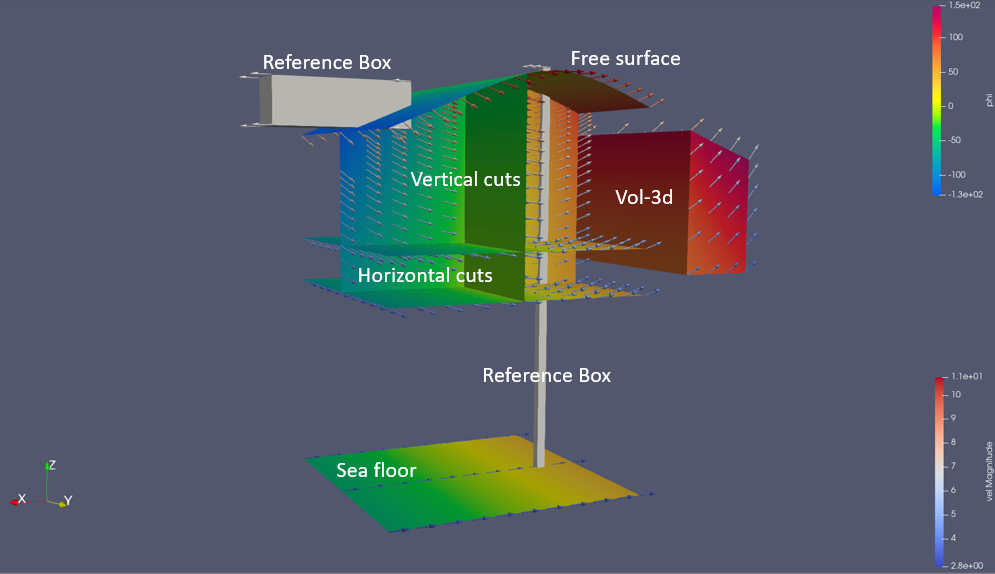
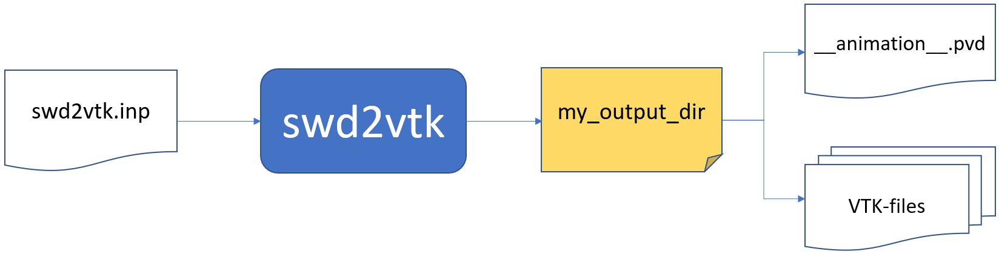

********************
Swd2vtk User's Guide
********************

   Various objects **swd2vtk** may construct. These objects and related fields are explained below.

.. contents:: Contents
   :local:

-------------
In a nutshell
-------------

The program **swd2vtk** is provided for making advanced three-dimensional visualization of SWD wave kinematics.
The program is a command line tool. The usage is outlined in this diagram

   Based on the contents of a text file, typical called :file:`swd2vtk.inp`, **swd2vtk** will generate a set
   of VTK files in a user specified subdirectory. In that directory there is a file :file:`__animation__.pvd`
   containing links to the relevant VTK files for different time steps. This file can be loaded into
   .e.g. `ParaView <https://www.paraview.org/>`_ for making advanced animations.

The input file could be named anything but in this document we apply the name :file:`swd2vtk.inp`.
If **swd2vtk** is in your path you can execute it using the command:

.. code-block:: bash

   swd2vtk swd2vtk.inp

The VTK files produced are of the new generation format (XML) and not the legacy VTK format. **swd2vtk** may
produce `ascii`, `binary` or `raw` VTK files.

Other relevant post-processing tools for the VTK-files are e.g.
`Mayavi <http://docs.enthought.com/mayavi/mayavi/>`_ and
`VTK for python <https://pypi.org/project/vtk/>`_.

.. note::

    The computational effort and file storage requirements for running  **swd2vtk** depends
    significantly on the user specified spatial and temporal resolution.

------------------
Example input file
------------------

The parameters in this :doc:`example file<tools_swd2vtk_inp_example>` are explained in the next sections.

.. toctree::
   :hidden:

   tools_swd2vtk_inp_example.rst

------------------
Coordinate systems
------------------

Swd2vtk has an application specific coordinate system
:math:`(\bar{x},\bar{y},\bar{z})` related to the SWD coordinate system :math:`(x,y,z)` as described
in the :doc:`theory<theory>` section of this documentation. The related constructor parameters are specified
in the input file :file:`swd2vtk.inp`.

To make it possible to simulate the SWD wave field near a ship moving with a constant speed
along the :math:`\bar{x}`-axis, an
**animation coordinate system** is introduced. This system is moving with a constant speed
:attr:`speedx` along the :math:`\bar{x}`-axis and coincide with the application coordinate system at
the application time :math:`\bar{t}=0`. All locations of objects specified in :file:`swd2vtk.inp` and
in the resulting VTK-files are with respect to the **animation coordinate system**.
All kinematics  presented in the VTK files (e.g. :math:`\frac{\partial\phi}{\partial \bar{t}}` and particle
velocities) are with respect to the earth fixed application coordinate system.

The reference speed :attr:`speedx` may take any real value. Negative values indicates that the 'ship' is
moving in the negative x-direction.

----------------
Input parameters
----------------

All input values in :file:`swd2vtk.inp` are specified in a Fortran namelist called ``swd2vtk`` as
demonstrated in the header of the :doc:`example file<tools_swd2vtk_inp_example>`.

Consequently, comments may be inserted anywhere using the tag "!".
Input variables may be specified in any order and in any column.
Parameters not specified in :file:`swd2vtk.inp`
will keep a default value. Default values are given in the tables below.
Characters are enclosed in quotes and logical/bools are specified using the letters T and F
without quotes.

Fortran namelist can be parsed and generated from Python using the PyPI package
`f90nml <https://github.com/marshallward/f90nml>`_. This package may also convert between
`YAML <https://en.wikipedia.org/wiki/YAML>`_ and namelist.

The following parameters are specified in :file:`swd2vtk.inp`.

File related parameters
^^^^^^^^^^^^^^^^^^^^^^^

.. list-table::
   :widths: 10 10 80
   :header-rows: 1

   * - parameter
     - type
     - description
   * - `file_swd`
     - char*200
     - | Name of the actual SWD file. (may include relative or full path)
       | No default (max 200 characters)
   * - `path_vtk`
     - char*200
     - | Name of the sub-directory to store VTK files. (may be full path)
       | No default (max 200 characters)
   * - `vtk_form`
     - char*10
     - | Tag to identify the VTK output file format:  'raw', 'binary' or 'ascii'.
       | Default is 'raw'

Time and speed parameters
^^^^^^^^^^^^^^^^^^^^^^^^^

.. list-table::
   :widths: 10 10 80
   :header-rows: 1

   * - parameter
     - type
     - description
   * - `tstart`
     - real
     - Start animation output at application time = `tstart` [s].  (Default: `tstart=0.0`)
   * - `tend`
     - real
     - End animation output at application time = `tend` [s]. (No default)
   * - `dt`
     - real
     - Applied time step in animation output [s]. (No default)
   * - `speedx`
     - real
     - | Speed of animation coordinates relative to earth fixed application sys. [m/s].
       | Default is `speedx=0.0`
   * - `time_fmt`
     - char*15
     - | Fortran format specifier for time string. E.g. `time_fmt = '(f0.3)'` (three digits)
       | Default:  `time_fmt = '(f0.3)'`

SWD constructor parameters
^^^^^^^^^^^^^^^^^^^^^^^^^^

.. list-table::
   :widths: 10 10 80
   :header-rows: 1

   * - parameter
     - type
     - description
   * - `x0_swd`
     - real
     - SWD constructor parameter `x0`. (Default: `x0_swd = 0.0`)
   * - `y0_swd`
     - real
     - SWD constructor parameter `y0`. (Default: `y0_swd = 0.0`)
   * - `t0_swd`
     - real
     - SWD constructor parameter `t0`. (Default: `t0_swd = 0.0`)
   * - `beta_swd`
     - real
     - SWD constructor parameter `beta`. (Default: `beta_swd = 0.0`)
   * - `impl_swd`
     - integer
     - SWD constructor parameter `impl`. (Default: `impl_swd = 0`)
   * - `norder_swd`
     - integer
     - SWD constructor parameter `norder`. (Default: `norder_swd = 0`)
   * - `ipol_swd`
     - integer
     - SWD constructor parameter `ipol`. (Default: `ipol_swd = 0`)
   * - `nsumx_swd`
     - integer
     - SWD constructor parameter `nsumx`. (Default: `nsumx_swd = -1`)
   * - `nsumy_swd`
     - integer
     - SWD constructor parameter `nsumy`. (Default: `nsumy_swd = -1`)
   * - `dc_bias_swd`
     - logical
     - SWD constructor parameter `dc_bias`. T or F. (Default: `dc_bias_swd = F`)
   * - `rho_swd`
     - real
     - | SWD constructor parameter `rho`. (Default: `rho_swd = 1025.0`)
       | Pressure will have unit meter water column if `rho_swd = 0.102`.

Requested scalar fields
^^^^^^^^^^^^^^^^^^^^^^^

To decide which scalar fields should be evaluated and included in the VTK files
we apply T/F flags representing True or False in the namelist. These fields are
calculated using the SWD class methods :meth:`pressure`, :meth:`phi` , :meth:`phi_t`,
:meth:`stream`, :meth:`elev`, :meth:`elev_t`, :meth:`grad_elev`,
:meth:`grad_phi_2nd` and :meth:`grad_elev_2nd`.

.. list-table::
   :widths: 10 10 80
   :header-rows: 1

   * - parameter
     - type
     - description
   * - `scl_prs`
     - logical
     - Total wave pressure from :meth:`pressure`. (Default: `scl_prs = F`)
   * - `scl_stream`
     - logical
     - Stream function from :meth:`stream`. (Default: `scl_stream = F`)
   * - `scl_phi`
     - logical
     - Velocity potential :math:`\phi` from :meth:`phi`. (Default: `scl_phi = F`)
   * - `scl_phi_t`
     - logical
     - :math:`\frac{\partial \phi}{\partial \bar{t}}` from :meth:`phi_t`. (Default: `scl_phi_t = F`)
   * - `scl_phi_xx`
     - logical
     - :math:`\frac{\partial^2 \phi}{\partial \bar{x}^2}` from :meth:`grad_phi_2nd`. (Default: `scl_phi_xx = F`)
   * - `scl_phi_xy`
     - logical
     - :math:`\frac{\partial^2 \phi}{\partial \bar{x}\partial \bar{y}}` from :meth:`grad_phi_2nd`. (Default: `scl_phi_xy = F`)
   * - `scl_phi_xz`
     - logical
     - :math:`\frac{\partial^2 \phi}{\partial \bar{x}\partial \bar{z}}` from :meth:`grad_phi_2nd`. (Default: `scl_phi_xz = F`)
   * - `scl_phi_yy`
     - logical
     - :math:`\frac{\partial^2 \phi}{\partial \bar{y}^2}` from :meth:`grad_phi_2nd`. (Default: `scl_phi_yy = F`)
   * - `scl_phi_yz`
     - logical
     - :math:`\frac{\partial^2 \phi}{\partial \bar{y}\partial \bar{z}}` from :meth:`grad_phi_2nd`. (Default: `scl_phi_yz = F`)
   * - `scl_phi_zz`
     - logical
     - :math:`\frac{\partial^2 \phi}{\partial \bar{z}^2}` from :meth:`grad_phi_2nd`. (Default: `scl_phi_zz = F`)
   * - `scl_elev`
     - logical
     - Wave elevation :math:`\zeta` from :meth:`elev`. (only on free surface) Default: `scl_elev = F`
   * - `scl_elev_t`
     - logical
     - :math:`\frac{\partial \zeta}{\partial \bar{t}}` from :meth:`elev_t`. (only on free surface)
       Default: `scl_elev_t = F`
   * - `scl_elev_x`
     - logical
     - :math:`\frac{\partial \zeta}{\partial \bar{x}}` from :meth:`grad_elev`. (only on free surface)
       Default: `scl_elev_x = F`
   * - `scl_elev_y`
     - logical
     - :math:`\frac{\partial \zeta}{\partial \bar{y}}` from :meth:`grad_elev`. (only on free surface)
       Default: `scl_elev_y = F`
   * - `scl_elev_xx`
     - logical
     - :math:`\frac{\partial^2 \zeta}{\partial \bar{x}^2}` from :meth:`grad_elev_2nd` (only on free surface).
       Default: `scl_elev_xx = F`
   * - `scl_elev_xy`
     - logical
     - :math:`\frac{\partial^2 \zeta}{\partial \bar{x}\partial \bar{y}}` from :meth:`grad_elev_2nd`. (only on free surface).
       Default: `scl_elev_xy = F`
   * - `scl_elev_yy`
     - logical
     - :math:`\frac{\partial^2 \zeta}{\partial \bar{y}^2}` from :meth:`grad_elev_2nd`. (only on free surface).
       Default: `scl_elev_yy = F`

Requested vector fields
^^^^^^^^^^^^^^^^^^^^^^^

To decide which vector fields should be evaluated and included in the VTK files
we apply T/F flags representing True or False in the namelist.
These fields are calculated using the SWD class methods
:meth:`grad_phi`, :meth:`acc_euler` and  :meth:`acc_particle`.

.. list-table::
   :widths: 10 10 80
   :header-rows: 1

   * - parameter
     - type
     - description
   * - `vec_vel`
     - logical
     - Particle velocity from :meth:`grad_phi`. (Default: `vec_vel = F`)
   * - `vec_acc_e`
     - logical
     - Local acceleration from :meth:`acc_euler`. (Default: `vec_acc_e = F`)
   * - `vec_acc_p`
     - logical
     - Particle acceleration  from :meth:`acc_particle`. (Default: `vec_acc_p = F`)

Free-surface sheet
^^^^^^^^^^^^^^^^^^

Using the variable `if_free_surf` the user may request a thin sheet
representing the instant position of the free-surface in a
rectangular horizontal region.

The center of this region is specified by the parameters
(x=`xc_free_surf`, y=`yc_free_surf`) with respect to the animation coordinate
system. The length of this region along the application x-dir is
`xlen_free_surf` and `ylen_free_surf` in the y-dir.

The number of evenly distributed cells in the x-dir and y-dir are
`npanx_free_surf` and `npany_free_surf` respectively. For each vertex in this
horizontal grid the instant wave elevation will be calculated. These wave elevations
defines the z-location of this surface sheet.

Selected scalar and vector fields are evaluated in the cell nodes of the free-surface sheet.

.. list-table::
   :widths: 10 10 80
   :header-rows: 1

   * - parameter
     - type
     - description
   * - `if_free_surf`
     - logical
     - | Flag to indicate if the free-surface sheet should be generated.
       | Default: `if_free_surf = T`
   * - `xc_free_surf`
     - real
     - The x-mid-point of sheet (animation coord. system). No default.
   * - `yc_free_surf`
     - real
     - The y-mid-point of sheet (animation coord. system). No default.
   * - `xlen_free_surf`
     - real
     - | The length of free-surface sheet in x-dir (animation coord. system).
       | No default.
   * - `ylen_free_surf`
     - real
     - | The length of free-surface sheet in y-dir (animation coord. system).
       | No default.
   * - `npanx_free_surf`
     - integer
     - Number of cells (>0) in x-dir (animation coord. system). No default.
   * - `npany_free_surf`
     - integer
     - Number of cells (>0) in y-dir (animation coord. system). No default.

Sea floor sheet
^^^^^^^^^^^^^^^

In case of finite depth simulations a sheet displaying the local bathymetry
can be generated. This feature is automatically turned off in case of infinite
water depth.

Using the variable `if_floor` the user may request a thin sheet representing
the sea floor in a rectangular horizontal region.

The center of this region is specified by the parameters
(x=`xc_floor`, y=`yc_floor`) with respect to the animation coordinate
system. The length of this region along the application x-dir is
`xlen_floor` and `ylen_floor` in the y-dir.

The number of evenly distributed cells in the x-dir and y-dir are
`npanx_floor` and `npany_floor` respectively. For each vertex in this
horizontal grid the local bathymetry is calculated. These values
defines the z-location of the sea floor.

Selected scalar and vector fields are evaluated in the nodes of the sea floor sheet.

.. list-table::
   :widths: 10 10 80
   :header-rows: 1

   * - parameter
     - type
     - description
   * - `if_floor`
     - logical
     - | Flag to indicate if the sea floor sheet should be generated.
       | Automatic F in case of infinite depth. Default: `if_floor = T`
   * - `xc_floor`
     - real
     - The x-mid-point of sheet (animation coord. system). No default.
   * - `yc_floor`
     - real
     - The y-mid-point of sheet (animation coord. system). No default.
   * - `xlen_floor`
     - real
     - | The length of sea floor sheet in x-dir (animation coord. system).
       | No default.
   * - `ylen_floor`
     - real
     - | The length of sea floor sheet in y-dir (animation coord. system).
       | No default.
   * - `npanx_floor`
     - integer
     - Number of cells (>0) in x-dir (animation coord. system). No default.
   * - `npany_floor`
     - integer
     - Number of cells (>0) in y-dir (animation coord. system). No default.

3D-volume block
^^^^^^^^^^^^^^^

Using the variable `if_vol3d` the user may request if a 3D structured domain
of hexahedrons should be generated.

The extent of this domain is rectangular in the horizontal plane.
In the vertical direction it occupies the space from `z=zmin_vol3d` up
to the instant free-surface.
The horizontal center of the domain is at (x=`xc_vol3d`, y=`yc_vol3d`).
The horizontal length of this domain along the application x-dir is
`xlen_vol3d` and `ylen_vol3d` in the y-dir.

The number of cells in the x-dir, y-dir and z-dir are
`npanx_vol3d`, `npany_vol3d` and `npanz_vol3d` respectively.
In the horizontal directions the cells are evenly spaced.
In the vertical direction it is possible to have smaller cells closer
to the free surface. The density of cells are controlled using
the expansion factor `z_exp_vol3d`.

Selected scalar and vector fields are evaluated in the nodes of each cell.

.. list-table::
   :widths: 10 10 80
   :header-rows: 1

   * - parameter
     - type
     - description
   * - `if_vol3d`
     - logical
     - | Flag to indicate if a 3D solid volume block should be generated.
       | Default: `if_vol3d = F`
   * - `xc_vol3d`
     - real
     - The x-mid-point of the volume (animation coord. system). No default.
   * - `yc_vol3d`
     - real
     - The y-mid-point of the volume (animation coord. system). No default.
   * - `zmin_vol3d`
     - real
     - The lowest z-value of the block (animation coord. system). No default.
   * - `xlen_vol3d`
     - real
     - | The length of the block in x-dir (animation coord. system).
       | No default.
   * - `ylen_vol3d`
     - real
     - | The length of the block in y-dir (animation coord. system).
       | No default.
   * - `npanx_vol3d`
     - integer
     - Number of cells (>0) in x-dir. No default.
   * - `npany_vol3d`
     - integer
     - Number of cells (>0) in y-dir. No default.
   * - `npanz_vol3d`
     - integer
     - Number of cells (>0) in z-dir. No default.
   * - `z_exp_vol3d`
     - real
     - | Expansion ratio for cell heights in z-dir. (1.0 = constant spacing)
       | Default: `z_exp_vol3d = 1.1` (cell height for cell below increase 10%)

Vertical cuts
^^^^^^^^^^^^^

The user may specify a number (`n_vcut`) of vertical cut-planes from
`z=zmin_vcut` up to the free-surface. The horizontal extent of this
sheet is `len_vcut`.
The horizontal center of each sheet is specified by the parameters
(x=`xc_vcut`, y=`yc_vcut`) with respect to the animation coordinate system.
The angle between the cut plane and the yz-plane is `beta_vcut`.

The number(s) of cells in the horizontal and vertical directions are
`npanxy_vcut` and `npanz_vcut`, respectively.
The spacing is constant in the horizontal direction.
In the vertical direction it is possible to have smaller cells closer
to the free surface. The density of cells are controlled using
the expansion factor `z_exp_vcut`.

Because there may be more than one vertical cut, the `*_vcut` parameters above are
arrays. Consequently, if you specify `n_vcut=3` you may specify

.. code-block:: fortran

   yc_vcut = 0.0  10.0  20.0    ! Specify for all cuts in one line...

in the input file. Similar for the other parameters denoted with the tag (A)
in the table below. As an alternative, in accordance with the Fortran namelist convention,
you may specify:

.. code-block:: fortran

   yc_vcut(1) = 0.0    ! One-based indexing
   yc_vcut(2) = 10.0
   yc_vcut(3) = 20.0

Selected scalar and vector fields are evaluated in the cell nodes of each vertical cut.

.. list-table::
   :widths: 10 10 80
   :header-rows: 1

   * - parameter
     - type
     - description
   * - `n_vcut`
     - integer
     - Number of vertical cuts to define. Default: `n_vcut = 0`
   * - `xc_vcut`
     - real (A)
     - | The x-mid-point(s) of vertical cuts (animation coord. system).
       | No default.
   * - `yc_vcut`
     - real (A)
     - | The y-mid-point(s) of vertical cuts (animation coord. system).
       | No default.
   * - `zmin_vcut`
     - real (A)
     - | The lowest z-value(s) of vertical cut(s) (animation coord. system).
       | No default.
   * - `len_vcut`
     - real (A)
     - | The horizontal length(s) of vertical cuts. No default.
   * - `beta_vcut`
     - real (A)
     - | The angle(s) between cut plane(s) and the yz-plane [deg]. No default.
       | e.g. 0.0 => yz plane, 90.0 => xz plane
   * - `npanxy_vcut`
     - integer (A)
     - | Number of cells (>0) in the horizontal direction for each cut.
       | No default.
   * - `npanz_vcut`
     - integer (A)
     - Number of cells (>0) in z-dir. No default.
   * - `z_exp_vcut`
     - real (A)
     - | Expansion ratio for cell heights in z-dir. (1.0 = constant spacing)
       | Default: `z_exp_vcut = 1.1` (cell height for cell below increase 10%)

Horizontal cuts
^^^^^^^^^^^^^^^

The user may specify a number (`n_hcut`) of horizontal rectangular cut-planes.

The center of each cut plane is specified by the parameters
(x=`xc_hcut`, y=`yc_hcut`) at `z=z_hcut` with respect to the animation coordinate
system. The length of this region along the application x-dir is
`xlen_hcut` and `ylen_hcut` in the y-dir.

The number(s) of evenly distributed cells in the x-dir and y-dir, are
`npanx_hcut` and `npany_hcut`, respectively.

Because there may be more than one horizontal cut, the `*_hcut` parameters above are
arrays. Consequently, if you specify `n_hcut=3` you may specify

.. code-block:: fortran

   z_hcut = -5.0  -10.0  -15.0  ! Specify for all cuts in one line...

in the input file. Similar for the other parameters denoted with the tag (A)
in the table below. As an alternative, in accordance with the Fortran namelist convention,
you may specify:

.. code-block:: fortran

   z_hcut(1) = -5.0    ! One-based indexing
   z_hcut(2) = -10.0
   z_hcut(3) = -15.0

Selected scalar and vector fields are evaluated in the cell nodes of each horizontal cut.

.. list-table::
   :widths: 10 10 80
   :header-rows: 1

   * - parameter
     - type
     - description
   * - `n_hcut`
     - integer
     - Number of horizontal cuts to define. Default: `n_hcut = 0`
   * - `xc_hcut`
     - real (A)
     - | The x-mid-point(s) of horizontal cuts (animation coord. system).
       | No default.
   * - `yc_hcut`
     - real (A)
     - | The y-mid-point(s) of horizontal cuts (animation coord. system).
       | No default.
   * - `z_hcut`
     - real (A)
     - | The constant z-value(s) of horizontal cut(s) (animation coord. system).
       | No default.
   * - `xlen_hcut`
     - real (A)
     - | The length of horizontal cut(s) in x-dir (animation coord. system).
       | No default.
   * - `ylen_hcut`
     - real (A)
     - | The length of horizontal cut(s) in y-dir (animation coord. system).
       | No default.
   * - `npanx_hcut`
     - integer (A)
     - Number of cells (>0) in x-dir (animation coord. system). No default.
   * - `npany_hcut`
     - integer (A)
     - Number of cells (>0) in y-dir (animation coord. system). No default.

Virtual boxes
^^^^^^^^^^^^^

The user may specify a number (`n_box`) of virtual boxes (rectangular cuboids)
for visual references in the animations.

These boxes may visualize the location and extent of ships, wave probes etc. to
better see relevant wave profiles at different time instances. These
boxes do not move relative to the animation coordinate system.

The virtual boxes do not affect the simulated wave kinematics. Wave kinematics
is not evaluated on virtual box surfaces.

The center of each virtual box is specified by the parameters
(x=`xc_box`, y=`yc_box`, z=`zc_box`) with respect to the animation coordinate
system. The dimensions of each box in the x-dir, y-dir and z-dir are
`xlen_box`, `ylen_box` and `zlen_box`, respectively.

Because there may be more than one box, the `*_box` parameters above are
arrays. Consequently, if you set `n_box=3` you may specify

.. code-block:: fortran

   xc_box = -50.0  0.0  50.0  ! Specify for all boxes in one line...

in the input file. Similar for the other parameters denoted with the tag (A)
in the table below. As an alternative, in accordance with the Fortran namelist convention,
you may specify:

.. code-block:: fortran

   xc_box(1) = -50.0    ! One-based indexing
   xc_box(2) =   0.0
   xc_box(3) =  50.0

.. list-table::
   :widths: 10 10 80
   :header-rows: 1

   * - parameter
     - type
     - description
   * - `n_box`
     - integer
     - Number of virtual boxes to define. Default: `n_box = 0`
   * - `xc_box`
     - real (A)
     - The x-mid-point(s) of boxes (animation coord. system). No default.
   * - `yc_box`
     - real (A)
     - The y-mid-point(s) of boxes (animation coord. system). No default.
   * - `zc_box`
     - real (A)
     - The z-mid-point(s) of boxes (animation coord. system). No default.
   * - `xlen_box`
     - real (A)
     - The length of boxes in x-dir (animation coord. system). No default.
   * - `ylen_box`
     - real (A)
     - The length of boxes in y-dir (animation coord. system). No default.
   * - `zlen_box`
     - real (A)
     - The length of boxes in z-dir (animation coord. system). No default.

-------------------------
Download and Installation
-------------------------

Binary distributions of **swd2vtk**, for Windows and Linux, can be downloaded from the release tab of the
GitHub repository **spectral_wave_data**.

.. note::

    To run **swd2vtk** on windows you need to download and install the latest version of the
    `Intel Redistributable Package for Fortran 2020
    <https://software.intel.com/en-us/articles/intel-compilers-redistributable-libraries-by-version>`_.
    The Intel redistributable contains required DLLs. If you already have a very recent Intel
    Fortran compiler installed you may skip this installation.

---------------
Acknowledgement
---------------

**swd2vtk** applies the library `VTKFortran <https://github.com/szaghi/VTKFortran>`_ by Stefano Zaghi (INSEAN)
under the MIT-license.
